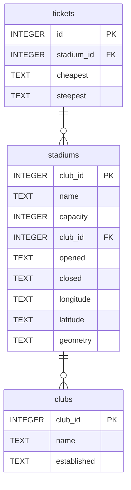

# Premier League Stadiums 🥅⚽

Database of Premier league stadiums

## Summary

- [Introduction](#introduction)
- [Database Type](#database-type)
- [Table Structure](#table-structure)
	- [clubs](#clubs)
	- [stadiums](#stadiums)
	- [tickets](#tickets)
- [Relationships](#relationships)
- [Database Diagram](#database-Diagram)

## Introduction
An attempt at creating a geospatial database, just for fun! Only one geometry type so far, however 🤔

### Objectives
- Create a database of premier league football club stadiums
- Store stadium location as Points
- Visualise in Zoho Analytics with tooltips with extra detail (ticket prices, stadium capacity etc)
- Have fun

## Database type
The below database schema documentation was created with the wonderful [drawDB](https://drawdb.vercel.app/editor) app 😍. 

> [!Info] Database change
> Originally this was intended to be a Spatialite database. I found that too difficult; the documentation is archaic and I couldn't get it working. Another time...  
>   
> Enter duckDB... 🦆

- **Database system:** ~~SQLite with SpatiaLite~~ duckDB
## Table structure

### clubs

| Name        | Type          | Settings                      | References                    | Note                           |
|-------------|---------------|-------------------------------|-------------------------------|--------------------------------|
| **club_id** | INTEGER | 🔑 PK, not null , unique, autoincrement |  | |
| **name** | TEXT | not null  |  | |
| **established** | TEXT | not null  |  | | 

### stadiums

| Name        | Type          | Settings                      | References                    | Note                           |
|-------------|---------------|-------------------------------|-------------------------------|--------------------------------|
| **stadium_id** | INTEGER | 🔑 PK, not null , unique, autoincrement |  | |
| **name** | TEXT | not null  |  | |
| **capacity** | INTEGER | not null  |  | |
| **club_id** | INTEGER | not null  | fk_stadiums_club_id_clubs | |
| **opened** | TEXT | not null  |  | |
| **closed** | TEXT | not null  |  | |
| **longitude** | TEXT | not null |  | |
| **latitude** | TEXT | not null |  | |
| **geometry** | TEXT | not null  |  | | 

### tickets

| Name        | Type          | Settings                      | References                    | Note                           |
|-------------|---------------|-------------------------------|-------------------------------|--------------------------------|
| **id** | INTEGER | 🔑 PK, not null , unique, autoincrement |  | |
| **stadium_id** | INTEGER | not null  | fk_tickets_stadium_id_stadiums | |
| **cheapest** | TEXT | |  | | 
| **steepest** | TEXT | |  | | 

## Relationships

- **stadiums to clubs**: one_to_many (optional)
- **tickets to stadiums**: one_to_one (optional)

## Database Diagram

