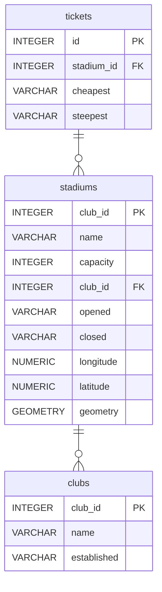

# Premier League Stadiums 🥅⚽

Database of Premier league stadiums

## Summary

- [Introduction](#introduction)
- [Database Type](#database-type)
- [Table Structure](#table-structure)
	- [clubs](#clubs)
	- [stadiums](#stadiums)
	- [tickets](#tickets)
- [Relationships](#relationships)
- [Database Diagram](#database-Diagram)

## Introduction
An attempt at creating a geospatial database, just for fun! Only one geometry type so far, however 🤔

### Objectives
- Create a database of premier league football club stadiums
- Store stadium location as Points
- Visualise in Zoho Analytics with tooltips with extra detail (ticket prices, stadium capacity etc)
- Have fun

### Known issues
- If creating the database using the code in `main.py`, the tables do not reference each other. DuckDB doesn't yet support adding foreing keys through `ALTER TABLE ... ADD FOREIGN KEY` syntax.
- The console will print a user warning when running `main.py` 
> `UserWarning: Geometry column does not contain geometry.`

### Repo contents
- `db_create.sql` Postgres and duckdb compliant commands to create the database.
- `main.py` script to extract, transform, and load the data into a duckdb database `stadiums.db`.


## Database type
The below database schema documentation was created with the wonderful [drawDB](https://drawdb.vercel.app/editor) app 😍. 

> [!Info] Database change
> Originally this was intended to be a Spatialite database. I found that too difficult; the documentation is archaic and I couldn't get it working. Another time...  
>   
> Enter duckDB... 🦆


- **Database system:** ~~SQLite with SpatiaLite~~ duckDB
## Table structure

### clubs

| Name        | Type          | Settings                      | References                    | Note                           |
|-------------|---------------|-------------------------------|-------------------------------|--------------------------------|
| **club_id** | INTEGER | 🔑 PK, not null , unique, autoincrement |  | |
| **name** | VARCHAR | not null  |  | |
| **established** | VARCHAR | not null  |  | | 


### stadiums

| Name        | Type          | Settings                      | References                    | Note                           |
|-------------|---------------|-------------------------------|-------------------------------|--------------------------------|
| **stadium_id** | INTEGER | 🔑 PK, not null , unique, autoincrement |  | |
| **name** | VARCHAR | not null  |  | |
| **capacity** | INTEGER | not null  |  | |
| **club_id** | INTEGER | not null  | fk_stadiums_club_id_clubs | |
| **opened** | VARCHAR | not null  |  | |
| **closed** | VARCHAR | not null  |  | |
| **longitude** | NUMERIC | not null |  | |
| **latitude** | NUMERIC | not null |  | |
| **geometry** | GEOMETRY | not null  |  | | 


### tickets

| Name        | Type          | Settings                      | References                    | Note                           |
|-------------|---------------|-------------------------------|-------------------------------|--------------------------------|
| **id** | INTEGER | 🔑 PK, not null , unique, autoincrement |  | |
| **stadium_id** | INTEGER | not null  | fk_tickets_stadium_id_stadiums | |
| **cheapest** | VARCHAR | |  | | 
| **steepest** | VARCHAR | |  | | 


## Relationships

- **stadiums to clubs**: one_to_many (optional)
- **tickets to stadiums**: one_to_one (optional)

## Database Diagram



### Map preview
```geojson
{
    "type": "FeatureCollection",
    "name": "stadiums",
    "features": [
        {
            "type": "Feature",
            "properties": {
                "stadium_id": 1,
                "name": "Anfield"
            },
                "geometry": {
                    "type": "Point",
                    "coordinates": [-2.96083, 53.43083]
                    }
            },
        {
            "type": "Feature",
            "properties": {
                "stadium_id": 2,
                "name": "Arsenal Stadium (Highbury)"
            },
                "geometry": {
                    "type": "Point",
                    "coordinates": [-0.10278, 51.55778]
                    }
            },
        {
            "type": "Feature",
            "properties": {
                "stadium_id": 3,
                "name": "Ayresome Park"
            },
                "geometry": {
                    "type": "Point",
                    "coordinates": [-1.24694, 54.56417]
                    }
            },
        {
            "type": "Feature",
            "properties": {
                "stadium_id": 4,
                "name": "Baseball Ground"
            },
                "geometry": {
                    "type": "Point",
                    "coordinates": [-1.46861, 52.90472]
                    }
            }
]
}
```
