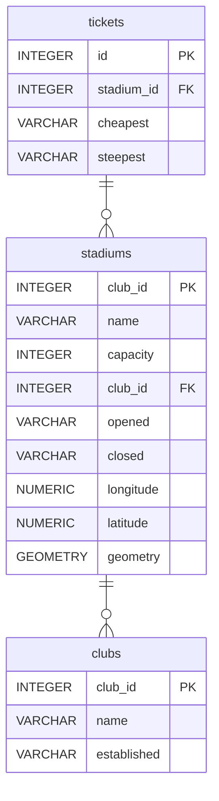

# Premier League Stadiums 🥅⚽

Database of Premier league stadiums

## Summary

- [Introduction](#introduction)
- [Database Type](#database-type)
- [Table Structure](#table-structure)
	- [clubs](#clubs)
	- [stadiums](#stadiums)
	- [tickets](#tickets)
- [Relationships](#relationships)
- [Database Diagram](#database-Diagram)

## Introduction
An attempt at creating a geospatial database, just for fun! Only one geometry type so far, however 🤔

### Objectives
- Create a database of premier league football club stadiums
- Store stadium location as Points
- Visualise in Zoho Analytics with tooltips with extra detail (ticket prices, stadium capacity etc)
- Have fun

### Known issues
- If creating the database using the code in `main.py`, the tables do not reference each other. DuckDB doesn't yet support adding foreing keys through `ALTER TABLE ... ADD FOREIGN KEY` syntax.
- The console will print a user warning when running `main.py` 
> `UserWarning: Geometry column does not contain geometry.`

### Repo contents
- `db_create.sql` Postgres and duckdb compliant commands to create the database.
- `main.py` script to extract, transform, and load the data into a duckdb database `stadiums.db`.


## Database type
The below database schema documentation was created with the wonderful [drawDB](https://drawdb.vercel.app/editor) app 😍. 

> [!Info] Database change
> Originally this was intended to be a Spatialite database. I found that too difficult; the documentation is archaic and I couldn't get it working. Another time...  
>   
> Enter duckDB... 🦆


- **Database system:** ~~SQLite with SpatiaLite~~ duckDB
## Table structure

### clubs

| Name        | Type          | Settings                      | References                    | Note                           |
|-------------|---------------|-------------------------------|-------------------------------|--------------------------------|
| **club_id** | INTEGER | 🔑 PK, not null , unique, autoincrement |  | |
| **name** | VARCHAR | not null  |  | |
| **established** | VARCHAR | not null  |  | | 


### stadiums

| Name        | Type          | Settings                      | References                    | Note                           |
|-------------|---------------|-------------------------------|-------------------------------|--------------------------------|
| **stadium_id** | INTEGER | 🔑 PK, not null , unique, autoincrement |  | |
| **name** | VARCHAR | not null  |  | |
| **capacity** | INTEGER | not null  |  | |
| **club_id** | INTEGER | not null  | fk_stadiums_club_id_clubs | |
| **opened** | VARCHAR | not null  |  | |
| **closed** | VARCHAR | not null  |  | |
| **longitude** | NUMERIC | not null |  | |
| **latitude** | NUMERIC | not null |  | |
| **geometry** | GEOMETRY | not null  |  | | 


### tickets

| Name        | Type          | Settings                      | References                    | Note                           |
|-------------|---------------|-------------------------------|-------------------------------|--------------------------------|
| **id** | INTEGER | 🔑 PK, not null , unique, autoincrement |  | |
| **stadium_id** | INTEGER | not null  | fk_tickets_stadium_id_stadiums | |
| **cheapest** | VARCHAR | |  | | 
| **steepest** | VARCHAR | |  | | 


## Relationships

- **stadiums to clubs**: one_to_many (optional)
- **tickets to stadiums**: one_to_one (optional)

## Database Diagram



### Map preview
```geojson
{
"type": "FeatureCollection",
"name": "stadiums",
"features": [
{ "type": "Feature", "properties": { "stadium_id": 1, "name": "Anfield", "club_id": 1, "opened": "1884", "closed": "nan", "capacity": "61276", "latitude": "53.43083", "longitude": "-2.96083", "geometry": "POINT (-2.96083 53.43083)" }, "geometry": null },
{ "type": "Feature", "properties": { "stadium_id": 2, "name": "Arsenal Stadium (also known as Highbury)", "club_id": 2, "opened": "1913", "closed": "2006", "capacity": "38419", "latitude": "51.55778", "longitude": "-0.10278", "geometry": "POINT (-0.10278 51.55778)" }, "geometry": null },
{ "type": "Feature", "properties": { "stadium_id": 3, "name": "Ayresome Park", "club_id": 3, "opened": "1903", "closed": "1995", "capacity": "26667", "latitude": "54.56417", "longitude": "-1.24694", "geometry": "POINT (-1.24694 54.56417)" }, "geometry": null },
{ "type": "Feature", "properties": { "stadium_id": 4, "name": "Baseball Ground", "club_id": 4, "opened": "1892", "closed": "2004", "capacity": "18300", "latitude": "52.90472", "longitude": "-1.46861", "geometry": "POINT (-1.46861 52.90472)" }, "geometry": null },
{ "type": "Feature", "properties": { "stadium_id": 5, "name": "bet365 Stadium Formerly Britannia Stadium", "club_id": 5, "opened": "1997", "closed": "nan", "capacity": "30089", "latitude": "52.98833", "longitude": "-2.17556", "geometry": "POINT (-2.17556 52.98833)" }, "geometry": null },
{ "type": "Feature", "properties": { "stadium_id": 6, "name": "Bloomfield Road", "club_id": 6, "opened": "1899", "closed": "nan", "capacity": "16220", "latitude": "53.80472", "longitude": "-3.04806", "geometry": "POINT (-3.04806 53.80472)" }, "geometry": null },
{ "type": "Feature", "properties": { "stadium_id": 7, "name": "Boleyn Ground (also known as Upton Park)", "club_id": 7, "opened": "1904", "closed": "2016", "capacity": "35345", "latitude": "51.53194", "longitude": "-0.03944", "geometry": "POINT (-0.03944 51.53194)" }, "geometry": null },
{ "type": "Feature", "properties": { "stadium_id": 8, "name": "Boundary Park", "club_id": 8, "opened": "1904", "closed": "nan", "capacity": "13559", "latitude": "53.55528", "longitude": "-2.12861", "geometry": "POINT (-2.12861 53.55528)" }, "geometry": null },
{ "type": "Feature", "properties": { "stadium_id": 9, "name": "Bramall Lane", "club_id": 9, "opened": "1855", "closed": "nan", "capacity": "32050", "latitude": "53.37028", "longitude": "-1.47083", "geometry": "POINT (-1.47083 53.37028)" }, "geometry": null },
{ "type": "Feature", "properties": { "stadium_id": 10, "name": "Brentford Community Stadium", "club_id": 10, "opened": "2020", "closed": "nan", "capacity": "17250", "latitude": "51.49082", "longitude": "-0.28870", "geometry": "POINT (-0.2887 51.49082)" }, "geometry": null },
{ "type": "Feature", "properties": { "stadium_id": 11, "name": "Burnden Park", "club_id": 11, "opened": "1895", "closed": "1997", "capacity": "22616", "latitude": "53.56889", "longitude": "-2.41611", "geometry": "POINT (-2.41611 53.56889)" }, "geometry": null },
{ "type": "Feature", "properties": { "stadium_id": 12, "name": "Cardiff City Stadium", "club_id": 12, "opened": "2009", "closed": "nan", "capacity": "33280", "latitude": "51.47278", "longitude": "-3.20306", "geometry": "POINT (-3.20306 51.47278)" }, "geometry": null },
{ "type": "Feature", "properties": { "stadium_id": 13, "name": "Carrow Road", "club_id": 13, "opened": "1935", "closed": "nan", "capacity": "27359", "latitude": "52.62222", "longitude": "-1.30917", "geometry": "POINT (-1.30917 52.62222)" }, "geometry": null },
{ "type": "Feature", "properties": { "stadium_id": 14, "name": "City Ground", "club_id": 14, "opened": "1898", "closed": "nan", "capacity": "30404", "latitude": "52.94000", "longitude": "-1.13278", "geometry": "POINT (-1.13278 52.94)" }, "geometry": null },
{ "type": "Feature", "properties": { "stadium_id": 15, "name": "City of Manchester Stadium", "club_id": 15, "opened": "2003", "closed": "nan", "capacity": "52900", "latitude": "53.48306", "longitude": "-2.20028", "geometry": "POINT (-2.20028 53.48306)" }, "geometry": null },
{ "type": "Feature", "properties": { "stadium_id": 16, "name": "County Ground", "club_id": 16, "opened": "1895", "closed": "nan", "capacity": "14700", "latitude": "51.56444", "longitude": "-1.77056", "geometry": "POINT (-1.77056 51.56444)" }, "geometry": null },
{ "type": "Feature", "properties": { "stadium_id": 17, "name": "Craven Cottage", "club_id": 17, "opened": "1896", "closed": "nan", "capacity": "24500", "latitude": "51.47500", "longitude": "-0.22167", "geometry": "POINT (-0.22167 51.475)" }, "geometry": null },
{ "type": "Feature", "properties": { "stadium_id": 18, "name": "Dean Court", "club_id": 18, "opened": "1910", "closed": "nan", "capacity": "11307", "latitude": "50.73528", "longitude": "-1.83833", "geometry": "POINT (-1.83833 50.73528)" }, "geometry": null },
{ "type": "Feature", "properties": { "stadium_id": 19, "name": "The Dell", "club_id": 19, "opened": "1898", "closed": "2001", "capacity": "15200", "latitude": "50.91472", "longitude": "-1.41306", "geometry": "POINT (-1.41306 50.91472)" }, "geometry": null },
{ "type": "Feature", "properties": { "stadium_id": 20, "name": "DW Stadium Formerly JJB Stadium", "club_id": 20, "opened": "1999", "closed": "nan", "capacity": "25138", "latitude": "53.54750", "longitude": "-2.65417", "geometry": "POINT (-2.65417 53.5475)" }, "geometry": null },
{ "type": "Feature", "properties": { "stadium_id": 21, "name": "Elland Road", "club_id": 21, "opened": "1897", "closed": "nan", "capacity": "37608", "latitude": "53.77778", "longitude": "-1.57222", "geometry": "POINT (-1.57222 53.77778)" }, "geometry": null },
{ "type": "Feature", "properties": { "stadium_id": 22, "name": "Emirates Stadium", "club_id": 22, "opened": "2006", "closed": "nan", "capacity": "60704", "latitude": "51.55500", "longitude": "-0.10861", "geometry": "POINT (-0.10861 51.555)" }, "geometry": null },
{ "type": "Feature", "properties": { "stadium_id": 23, "name": "Ewood Park", "club_id": 23, "opened": "1890", "closed": "nan", "capacity": "31367", "latitude": "53.72861", "longitude": "-2.48917", "geometry": "POINT (-2.48917 53.72861)" }, "geometry": null },
{ "type": "Feature", "properties": { "stadium_id": 24, "name": "Falmer Stadium", "club_id": 24, "opened": "2011", "closed": "nan", "capacity": "31876", "latitude": "50.86182", "longitude": "-0.08327", "geometry": "POINT (-0.08327 50.86182)" }, "geometry": null },
{ "type": "Feature", "properties": { "stadium_id": 25, "name": "Filbert Street", "club_id": 25, "opened": "1891", "closed": "2002", "capacity": "22000", "latitude": "52.62361", "longitude": "-1.14056", "geometry": "POINT (-1.14056 52.62361)" }, "geometry": null },
{ "type": "Feature", "properties": { "stadium_id": 26, "name": "Fratton Park", "club_id": 26, "opened": "1898", "closed": "nan", "capacity": "20978", "latitude": "50.79639", "longitude": "-1.06389", "geometry": "POINT (-1.06389 50.79639)" }, "geometry": null },
{ "type": "Feature", "properties": { "stadium_id": 27, "name": "Goodison Park", "club_id": 27, "opened": "1892", "closed": "nan", "capacity": "39414", "latitude": "53.43889", "longitude": "-2.96639", "geometry": "POINT (-2.96639 53.43889)" }, "geometry": null },
{ "type": "Feature", "properties": { "stadium_id": 28, "name": "The Hawthorns", "club_id": 28, "opened": "1900", "closed": "nan", "capacity": "26445", "latitude": "52.50917", "longitude": "-1.96389", "geometry": "POINT (-1.96389 52.50917)" }, "geometry": null },
{ "type": "Feature", "properties": { "stadium_id": 29, "name": "Highfield Road", "club_id": 29, "opened": "1899", "closed": "2005", "capacity": "23489", "latitude": "52.41194", "longitude": "-1.49000", "geometry": "POINT (-1.49 52.41194)" }, "geometry": null },
{ "type": "Feature", "properties": { "stadium_id": 30, "name": "Hillsborough Stadium", "club_id": 30, "opened": "1899", "closed": "nan", "capacity": "39812", "latitude": "53.41139", "longitude": "-1.50056", "geometry": "POINT (-1.50056 53.41139)" }, "geometry": null },
{ "type": "Feature", "properties": { "stadium_id": 31, "name": "Kenilworth Road", "club_id": 31, "opened": "1905", "closed": "nan", "capacity": "10265", "latitude": "51.88417", "longitude": "-0.43167", "geometry": "POINT (-0.43167 51.88417)" }, "geometry": null },
{ "type": "Feature", "properties": { "stadium_id": 32, "name": "King Power Stadium Formerly Walkers Stadium", "club_id": 32, "opened": "2002", "closed": "nan", "capacity": "32259", "latitude": "52.62028", "longitude": "-1.14222", "geometry": "POINT (-1.14222 52.62028)" }, "geometry": null },
{ "type": "Feature", "properties": { "stadium_id": 33, "name": "Kirklees Stadium", "club_id": 33, "opened": "1994", "closed": "nan", "capacity": "24500", "latitude": "53.65417", "longitude": "-1.76833", "geometry": "POINT (-1.76833 53.65417)" }, "geometry": null },
{ "type": "Feature", "properties": { "stadium_id": 34, "name": "Loftus Road", "club_id": 34, "opened": "1904", "closed": "nan", "capacity": "18439", "latitude": "51.50917", "longitude": "-0.23222", "geometry": "POINT (-0.23222 51.50917)" }, "geometry": null },
{ "type": "Feature", "properties": { "stadium_id": 35, "name": "London Stadium Formerly Olympic Stadium", "club_id": 35, "opened": "2016[29]", "closed": "nan", "capacity": "62500", "latitude": "51.53861", "longitude": "-0.01639", "geometry": "POINT (-0.01639 51.53861)" }, "geometry": null },
{ "type": "Feature", "properties": { "stadium_id": 36, "name": "Madejski Stadium", "club_id": 36, "opened": "1998", "closed": "nan", "capacity": "24161", "latitude": "51.42222", "longitude": "-0.98278", "geometry": "POINT (-0.98278 51.42222)" }, "geometry": null },
{ "type": "Feature", "properties": { "stadium_id": 37, "name": "Maine Road", "club_id": 37, "opened": "1923", "closed": "2003", "capacity": "35150", "latitude": "53.45111", "longitude": "-2.23528", "geometry": "POINT (-2.23528 53.45111)" }, "geometry": null },
{ "type": "Feature", "properties": { "stadium_id": 38, "name": "MKM Stadium Formerly KCOM Stadium", "club_id": 38, "opened": "2002", "closed": "nan", "capacity": "25400", "latitude": "53.74611", "longitude": "-0.36750", "geometry": "POINT (-0.3675 53.74611)" }, "geometry": null },
{ "type": "Feature", "properties": { "stadium_id": 39, "name": "Molineux Stadium", "club_id": 39, "opened": "1889", "closed": "nan", "capacity": "31750", "latitude": "52.59028", "longitude": "-2.13028", "geometry": "POINT (-2.13028 52.59028)" }, "geometry": null },
{ "type": "Feature", "properties": { "stadium_id": 40, "name": "Oakwell", "club_id": 40, "opened": "1887", "closed": "nan", "capacity": "23009", "latitude": "53.55222", "longitude": "-1.46750", "geometry": "POINT (-1.4675 53.55222)" }, "geometry": null },
{ "type": "Feature", "properties": { "stadium_id": 41, "name": "Old Trafford", "club_id": 41, "opened": "1910", "closed": "nan", "capacity": "74197", "latitude": "53.46306", "longitude": "-2.29139", "geometry": "POINT (-2.29139 53.46306)" }, "geometry": null },
{ "type": "Feature", "properties": { "stadium_id": 42, "name": "Portman Road", "club_id": 42, "opened": "1884", "closed": "nan", "capacity": "29813", "latitude": "52.05500", "longitude": "-1.14472", "geometry": "POINT (-1.14472 52.055)" }, "geometry": null },
{ "type": "Feature", "properties": { "stadium_id": 43, "name": "Pride Park Stadium", "club_id": 43, "opened": "1997", "closed": "nan", "capacity": "33597", "latitude": "52.91500", "longitude": "-1.44722", "geometry": "POINT (-1.44722 52.915)" }, "geometry": null },
{ "type": "Feature", "properties": { "stadium_id": 44, "name": "Riverside Stadium", "club_id": 44, "opened": "1995", "closed": "nan", "capacity": "33746", "latitude": "54.57833", "longitude": "-1.21694", "geometry": "POINT (-1.21694 54.57833)" }, "geometry": null },
{ "type": "Feature", "properties": { "stadium_id": 45, "name": "Roker Park", "club_id": 45, "opened": "1898", "closed": "1997", "capacity": "22500", "latitude": "54.92139", "longitude": "-1.37556", "geometry": "POINT (-1.37556 54.92139)" }, "geometry": null },
{ "type": "Feature", "properties": { "stadium_id": 46, "name": "St Andrew's", "club_id": 46, "opened": "1906", "closed": "nan", "capacity": "30079", "latitude": "52.47583", "longitude": "-1.86806", "geometry": "POINT (-1.86806 52.47583)" }, "geometry": null },
{ "type": "Feature", "properties": { "stadium_id": 47, "name": "St James' Park", "club_id": 47, "opened": "1880", "closed": "nan", "capacity": "52258", "latitude": "54.97556", "longitude": "-1.62167", "geometry": "POINT (-1.62167 54.97556)" }, "geometry": null },
{ "type": "Feature", "properties": { "stadium_id": 48, "name": "St Mary's Stadium", "club_id": 48, "opened": "2001", "closed": "nan", "capacity": "32384", "latitude": "50.90583", "longitude": "-1.39111", "geometry": "POINT (-1.39111 50.90583)" }, "geometry": null },
{ "type": "Feature", "properties": { "stadium_id": 49, "name": "Selhurst Park", "club_id": 49, "opened": "1924", "closed": "nan", "capacity": "25194", "latitude": "51.39833", "longitude": "-0.08556", "geometry": "POINT (-0.08556 51.39833)" }, "geometry": null },
{ "type": "Feature", "properties": { "stadium_id": 50, "name": "Stadium of Light", "club_id": 50, "opened": "1997", "closed": "nan", "capacity": "48707", "latitude": "54.91444", "longitude": "-1.38833", "geometry": "POINT (-1.38833 54.91444)" }, "geometry": null },
{ "type": "Feature", "properties": { "stadium_id": 51, "name": "Stamford Bridge", "club_id": 51, "opened": "1877", "closed": "nan", "capacity": "40173", "latitude": "51.48167", "longitude": "-0.19111", "geometry": "POINT (-0.19111 51.48167)" }, "geometry": null },
{ "type": "Feature", "properties": { "stadium_id": 52, "name": "Swansea.com Stadium Formerly Liberty Stadium", "club_id": 52, "opened": "2005", "closed": "nan", "capacity": "20937", "latitude": "51.64278", "longitude": "-3.93472", "geometry": "POINT (-3.93472 51.64278)" }, "geometry": null },
{ "type": "Feature", "properties": { "stadium_id": 53, "name": "Tottenham Hotspur Stadium", "club_id": 53, "opened": "2019", "closed": "nan", "capacity": "62850", "latitude": "51.60472", "longitude": "-0.06639", "geometry": "POINT (-0.06639 51.60472)" }, "geometry": null },
{ "type": "Feature", "properties": { "stadium_id": 54, "name": "Turf Moor", "club_id": 54, "opened": "1883", "closed": "nan", "capacity": "21744", "latitude": "53.78917", "longitude": "-2.23028", "geometry": "POINT (-2.23028 53.78917)" }, "geometry": null },
{ "type": "Feature", "properties": { "stadium_id": 55, "name": "University of Bolton Stadium Formerly Reebok Stadium and Macron Stadium", "club_id": 55, "opened": "1997", "closed": "nan", "capacity": "28723", "latitude": "53.58056", "longitude": "-2.53556", "geometry": "POINT (-2.53556 53.58056)" }, "geometry": null },
{ "type": "Feature", "properties": { "stadium_id": 56, "name": "The Valley", "club_id": 56, "opened": "1919", "closed": "nan", "capacity": "27111", "latitude": "51.48639", "longitude": "-0.03639", "geometry": "POINT (-0.03639 51.48639)" }, "geometry": null },
{ "type": "Feature", "properties": { "stadium_id": 57, "name": "Valley Parade", "club_id": 57, "opened": "1886", "closed": "nan", "capacity": "25136", "latitude": "53.80417", "longitude": "-1.75889", "geometry": "POINT (-1.75889 53.80417)" }, "geometry": null },
{ "type": "Feature", "properties": { "stadium_id": 58, "name": "Vicarage Road", "club_id": 58, "opened": "1922", "closed": "nan", "capacity": "22200", "latitude": "51.65000", "longitude": "-0.40167", "geometry": "POINT (-0.40167 51.65)" }, "geometry": null },
{ "type": "Feature", "properties": { "stadium_id": 59, "name": "Villa Park", "club_id": 59, "opened": "1897", "closed": "nan", "capacity": "42918", "latitude": "52.50917", "longitude": "-1.88472", "geometry": "POINT (-1.88472 52.50917)" }, "geometry": null },
{ "type": "Feature", "properties": { "stadium_id": 60, "name": "Wembley Stadium", "club_id": 60, "opened": "2007", "closed": "nan", "capacity": "90000", "latitude": "51.55583", "longitude": "-0.27972", "geometry": "POINT (-0.27972 51.55583)" }, "geometry": null },
{ "type": "Feature", "properties": { "stadium_id": 61, "name": "White Hart Lane", "club_id": 61, "opened": "1899", "closed": "2017", "capacity": "36284", "latitude": "51.60333", "longitude": "-0.06583", "geometry": "POINT (-0.06583 51.60333)" }, "geometry": null }
]
}
```